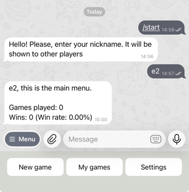
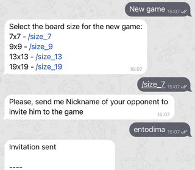
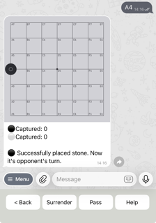
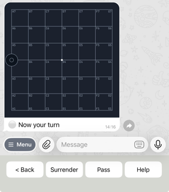

# How to play

Go to the [main README](../../readme.md)

## Register in the bot
1. Start a chat with the Telegram bot you created.
2. Send your username to the bot. Userneme is required to identify you in the game.

## Main Menu
Navigation in the bot is done through menus.

After registration, you will see the main menu with the following options:
- **New Game**: Create a new game and invite another player.
- **My Games**: View and manage your current games, including joining invitations and finished games.
- **Settings**: Change your preferences, such as the board theme.

### Example of the main menu

## New Game Menu
In the New Game menu, you can create a new game by selecting the board size and inviting another player.

1. Click on "New Game".
2. Select the desired board size (bot will support 9x9, 13x13, and 19x19 sizes).
3. Enter the username of the player you want to invite.
4. Invitation will be sent to the invited player. You will be notified when they accept or decline the invitation.

### Example of the new game menu

## Game Menu
Once a game is started, you will enter the Game menu where you can make moves and see the current state of the board.
The first to move is the person who created the game. They play with black pieces.
To make a move, send the bot a message with the number of the square where you want to place your piece.
After the move, a message is sent to the opponent informing them that a move has been made and it is now their turn.

### Example of the game menu

### Example of the game menu (opponent)

### End of game
The game ends when one of the players gives up or there are 3 missed turns.